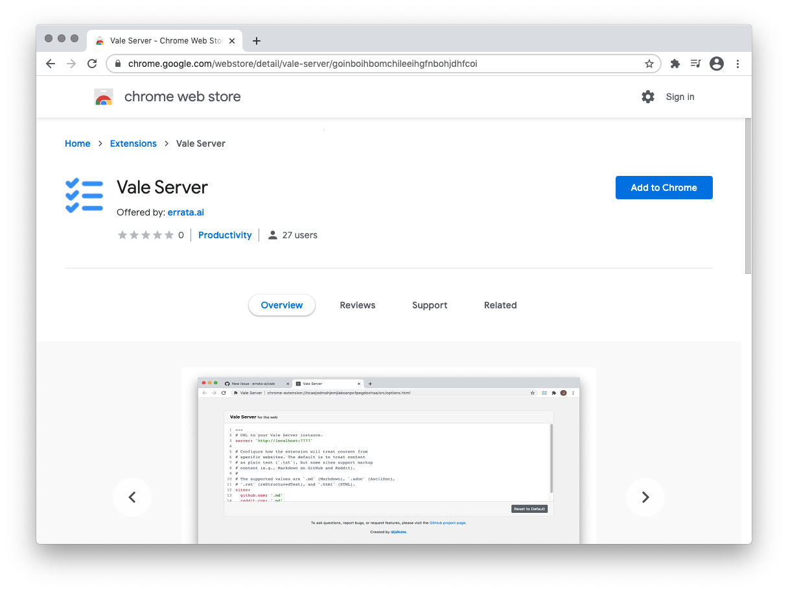

## Installation


**Heads up**!

Check out "[Taking Vale Server to the web][1]" for an explanation of how our
extension is different from most other writing tools.

[1]: https://medium.com/valelint/taking-vale-server-to-the-web-4de44b32e547


Go to the [installation page](https://chrome.google.com/webstore/detail/vale-server/goinboihbomchileeihgfnbohjdhfcoi) and click the *Add to Chrome* button:

## Usage

This extension supports both `<textarea>` and `contenteditable` elements, and should work on most websites out-of-the-box.

To use the extension, click its toolbar icon after editing some text on the
current page.

## Configuration

To open the settings page, click the extension's icon and then *Options*:

Here, you can assign certain markup formats to specific URLs&mdash;such as,
for example, writing Markdown on GitHub.
