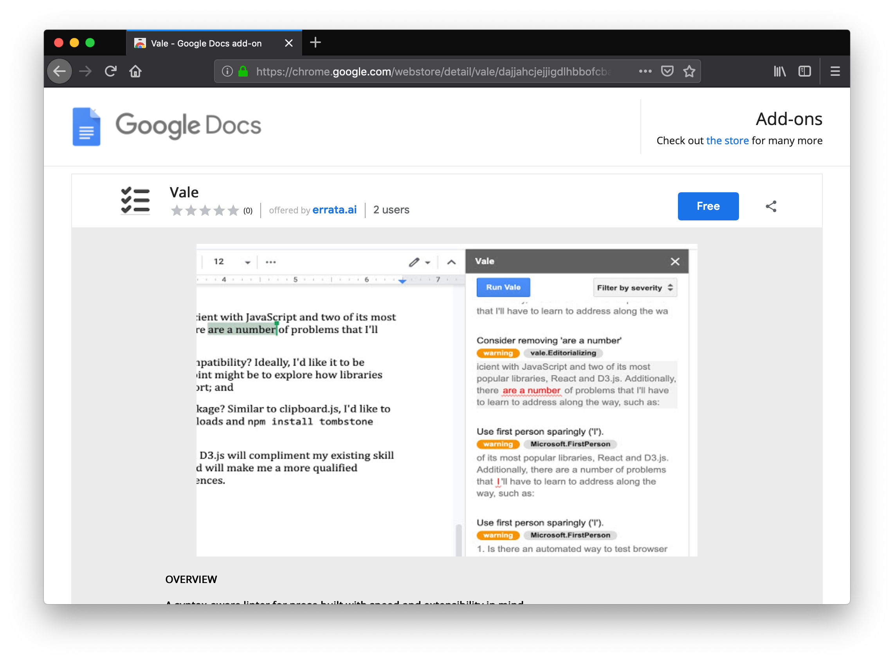
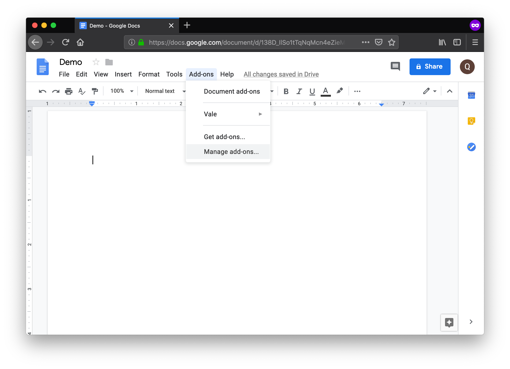
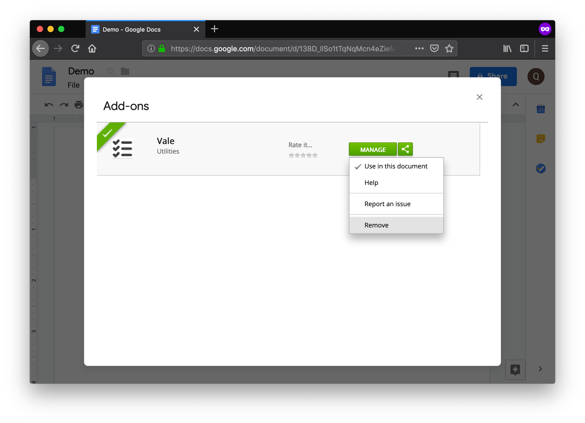

## Installation


The Google Docs add-on currently *doesn't* support the Safari web browser.


Go to the [installation page](https://workspace.google.com/marketplace/app/vale/977109187872?hl=en) and click the *Free* button:

Then, follow the on-screen instructions.

## Usage

<!-- vale Base.SpellCheck = NO -->

To run Vale Server on your current document, select
**Add-ons** &rarr; **Vale** &rarr; **Show Sidebar**:

## Uninstallation

To remove the add-on, select **Add-ons** &rarr; **Manage add-ons...**:

<!-- vale Base.SpellCheck = YES -->

And then, next to the Vale add-on, select **MANAGE** &rarr; **Remove**:

