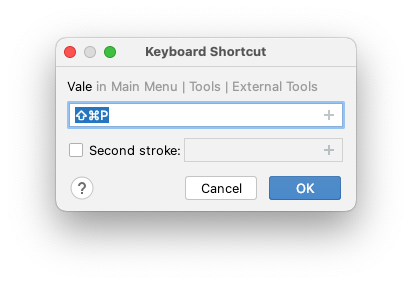

There are two options for using Vale with the suite of tools by JetBrains: You
can either configure Vale as an [external tool][1] or use the [Grazie][2]
plugin.

If you configure the CLI, Vale will work exactly as it does on the command line.
The Grazie plugin, however, only supports a subset of Vale's functionality and
may not work exactly as the CLI does in all cases.

## External tool

To configure Vale as an external tool, go to
`Preferences > Tools > External Tools` and add Vale:



Then, to run Vale on the current file, click `Tools > External Tools > Vale`.
An output panel will appear with clickable navigation links:



### Add an icon (optional)


**Heads up**!

If you want to use the demo icon in your own toolbar, you can [find it here][1].

[1]: https://avatars.githubusercontent.com/u/32996943?s=200&v=4


Go to `Preferences > Appearance & Behavior > Menus and Toolbars > Main Toolbar > Toolbar Run Actions` and then add an action:



The new action will now appear in your toolbar:



### Add a shortcut (optional)

Go to `Preferences > Keymap > External Tools > Vale`, click
"Add Keyboard Shortcut", and enter a shortcut of your choice:

  

    
  

  

    
  

## Grazie

[Grazie Professional][2] is plugin developed by the JetBrains' team that
"provides intelligent grammar checks, completion, and writing assistance for
natural language."

It includes a ["Project style guides"][3] feature that "lets you automate checks
against various styles guides." They use Vale's YAML-based syntax to power
this feature, but currently on support a subset of its overall functionality.

[1]: https://www.jetbrains.com/help/idea/configuring-third-party-tools.html
[2]: https://plugins.jetbrains.com/plugin/16136-grazie-
[3]: https://plugins.jetbrains.com/plugin/16136-grazie-professional/docs/project-style-guides.html
