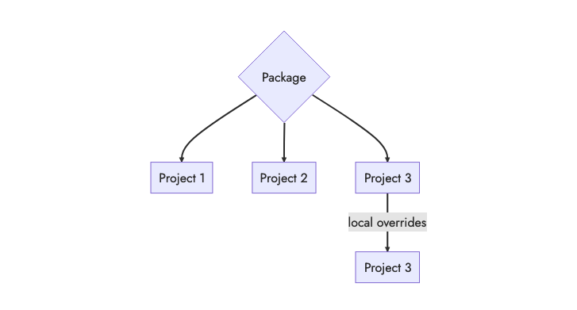

## Overview

Packages provide a means of sharing, extending, syncing, and updating Vale configurations.



In the example above, Project 1 and 2 will have identical configurations (as inherited from the upstream package). Any changes to the upstream package will propagate to both projects.

Project 3 starts with the same configuration as 1 and 2, but applies its own
overrides through a local `.vale.ini` file&mdash;for example, maybe you want to
disable a rule or change a rule's severity.

## Structure and Hosting

A package is a `.zip` file that contains a `.vale.ini` file, a `StylesPath`
folder, or both. You include a package by using the top-level `Packages` key
in your local `.vale.ini` file:

```ini
StylesPath = .github/styles
MinAlertLevel = suggestion

Packages = Microsoft, \
https://github.com/errata-ai/errata.ai/releases/download/v1.0.0/Test.zip

[README.md]
BasedOnStyles = Vale
```

The `Packages` key accepts four types of values:

  1. A name of a package hosted
in the official [Package Hub](/hub/);
  2. a URL to an externally-hosted
package;
  3. an absolute or relative path to a `.zip` file located in the local file system; or
  4. an absolute or relative path to a directory containing package files.

## Style-only

Style-only (such as [write-good][1]) packages are a  `.zip` archive of a single
style folder:

```console
$ unzip write-good.zip
Archive:  write-good.zip
   creating: write-good/
  inflating: write-good/README.md
  inflating: write-good/Cliches.yml
  inflating: write-good/ThereIs.yml
  inflating: write-good/Weasel.yml
  inflating: write-good/TooWordy.yml
  inflating: write-good/Passive.yml
  inflating: write-good/So.yml
  inflating: write-good/Illusions.yml
  inflating: write-good/E-Prime.yml
  inflating: write-good/meta.json
```

After running the [`sync`](/manual/sync) command, the style will be added to
the active `StylesPath`.

## Config-only

Config-only (such as [Hugo][2]) packages are a  `.zip` archive of a single
`.vale.ini` file:

```console
$ unzip Hugo.zip
Archive:  Hugo.zip
   creating: Hugo/
  inflating: Hugo/.vale.ini
```

After running the [`sync`](/manual/sync) command, the configuration file be
added to `StylesPath/.config` according to the order in which it was loaded.

## Complete

Complete packages contain both a `.vale.ini` file and an associated
`StylesPath` folder.

The `StylesPath` should be named "styles" and can contain any
typically-supported subfolder&mdash;such as [styles](/docs/topics/styles) and
[vocabularies](/docs/topics/vocab). The `.vale.ini` file should reference the
included `StylesPath`:

```ini
# This is subfolder included in our .zip archive.
StylesPath = styles

# Complete packages can include other, externally-defined
# packages.
Packages = proselint

# Normal configuration ...
[*.{md,adoc}]
Test.Rule = YES
```

The packaged `StylesPath` will be merged with the active local `StylesPath`
and any included configuration files will be added to the local
`StylesPath/.config` folder.

## Package ordering and overrides

In the case of conflicting configuration, the order in which packages are
loaded is important:

```ini
Packages = pkg1, pkg2

# Local configuration ...
[*.{md,adoc}]
Test.Rule = YES
```

In the above example, `pkg2` will override any conflicting configuration from
`pkg1`. Similarly, local configuration will override any conflicting package.

## Packages and VCS

You'll want to add any packaged configuration components to your `.gitignore`
(or equivalent) file.

While this can be as simple as ignoring your entire `StylesPath`, it's likely
that you'll also have some local components  as well.

```ini
# We want to ignore our StylesPath *except* for our local
# `vocabularies/Base` directory.

.github/styles/*
!.github/styles/config/

.github/styles/config/*
!.github/styles/config/vocabularies/

.github/styles/config/vocabularies/*
!.github/styles/config/vocabularies/Base
```

The above example ignores the entire `.github/styles/` folder *except* for
`.github/styles/config/vocabularies/Base` (which we want to track changes for). 
The rules to ignore subfolders are written in pairs because Git disregards
skip-level unignore rules. Any unignored item should have its parent folder
unignored as well.

[1]: /hub/write-good/
[2]: /hub/hugo/
