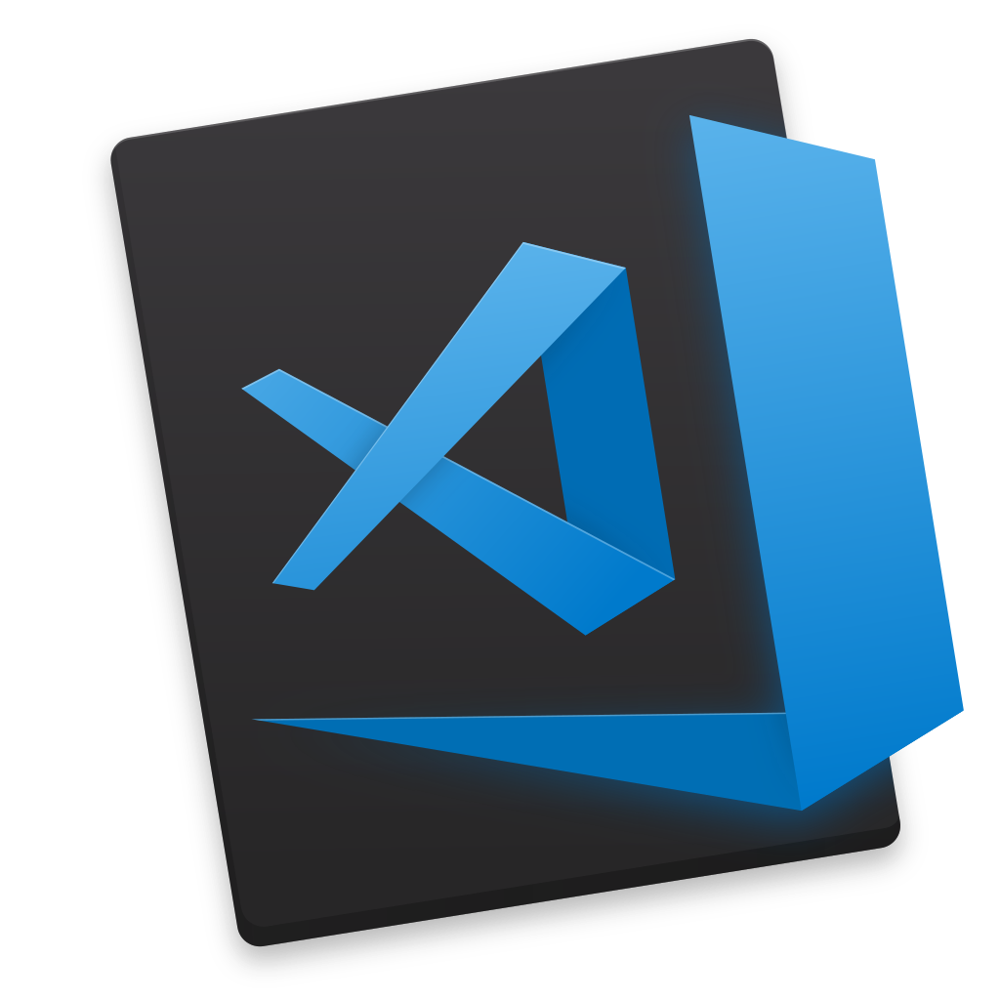

## Installing a style

The first step you'll need to take before using Vale Server is to ensure that
you have [styles](/docs/topics/styles) available somewhere on your machine. You
have a few options for doing this:

1. You can use the dashboard to install pre-made style from our
   community-maintained library.

2. You can copy or clone your own styles into the default `StylesPath`
   (select **Browse Styles...** from the context menu).

3. You can specify a custom `StylesPath` that already contains your styles in
   a project (see Step 2).

## Creating a project

After you've installed a style (or styles), you need to create a
project. Click on the **Preferences...** option from the context
menu and follow the instructions on
[creating a new project](docs/vale-server/gui/#projects).

## Using a client application

The final step is to install one of our third-party integrations. These allow
you to see suggestions based on your active project while you write.

<table>
   <caption>Click on a logo below to learn more.</caption>
   <thead>
      <tr align="center">
         <th>Atom</th>
         <th>Chrome</th>
         <th>Google Docs</th>
         <th>Sublime Text</th>
         <th>VS Code</th>
      </tr>
   </thead>
   <tbody>
      <tr align="center">
         <td>
            
         </td>
         <td>
            
         </td>
         <td>
            
         </td>
         <td align="center">
            
         </td>
         <td align="center">
            
         </td>
      </tr>
   </tbody>
</table>

## Choosing a mode

Vale Server can run in one of three modes, as described below.

1. `Server`: Vale Server will check documents solely based on the active
    project's configuration.

2. `Compatibility`: Vale Server will check documents according to their
   associated local Vale configuration files while respecting the following
   override rules:

      - Any multi-value entry in your project's `.vale.ini` (for example,
      `BasedOnStyles`) will be combined with the remote entry.

      - Any single-value entry in your project's `.vale.ini` (for example,
      `MinAlertLevel`) will override the remote entry altogether.

3. `Command Line`: Vale Server will check documents solely based on the their
   local Vale configurations.

You can switch between modes through the context menu's `Select Mode` option.
